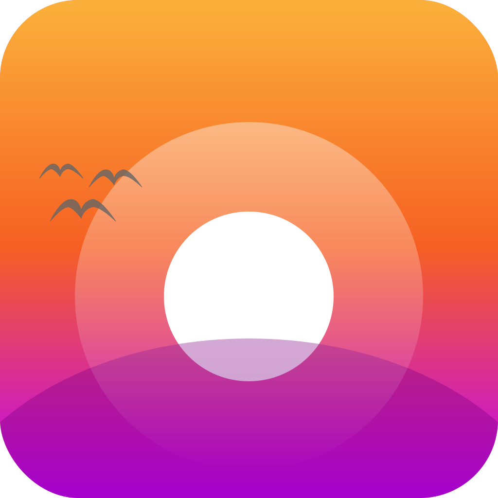

<p align="center">

</p>

# Swift Sunrise/Sunset

Extensible and lightweight package for getting the sunrise and sunset for a location and time in Swift.

## Motivation

Getting the sunrise or sunset is useful for many creative and practical applications.

Ideally developers would use a first-party solution. Apple's [WeatherKit][WeatherKit] offers sunrise and sunset times, but Apple developers only get [500,000 calls for free per month][WeatherKitFreeAmount]. Thankfully, we can calculate the sunrise or sunset for a given location and time using an on-device algorithm.

This package is designed with the following principles at its core:

* **Extensibility:** Folks have developed different algorithms for calculating sunrise and sunset times, with varying results. This package provides an easy way to add additional algorithms through the `SunriseSunsetProvider` type.

* **Modernity:** This package follows the latest Swift style and is distributed through [Swift Package Manager][SPM]. 

* **Test Coverage:** Unit tests verify that provided methods work as expected, so you can feel more comfortable pulling this code in than a snippet.

## Usage

To get the sunrise, use the `SwiftSunriseSunset.sunrise(...)` method:

```swift
let sunrise: Date? = SwiftSunriseSunset.sunrise(
    for: Date.now,
    in: TimeZone.current,
    at: CLLocationCoordinate2D(
        latitude: 37.773972, 
        longitude: -122.431297
    )
)
```

Usage is identical for the `SwiftSunriseSunset.sunset(...)` method. 

Both methods have overloads to explicitly pass the latitude and longitude, so it is not necessary to import CoreLocation to use this package.

## Credits

Thanks goes to [Paul Schlyter](http://www.stjarnhimlen.se/english.php), who released a [C algorithm](http://www.stjarnhimlen.se/comp/sunriset.c) for calculating sun times to the public domain in 1992. The primary algorithm for sun times calculations is derived from his original code.

This was inspired by the work of Neil Tiffin (GitHub: [neilt](https://github.com/neilt)) who in 2019 ported Schlyter's sun times algorithm to Swift and published as a [gist](https://gist.github.com/neilt/6bc284ac7ce00d566002bc45bc0d86dd). 

## License

This package is released under the MIT license. See [LICENSE](LICENSE) for details.

[WeatherKit]: https://developer.apple.com/documentation/weatherkit/sunevents/sunrise
[WeatherKitFreeAmount]: https://developer.apple.com/weatherkit/get-started/
[SPM]: https://www.swift.org/documentation/package-manager/